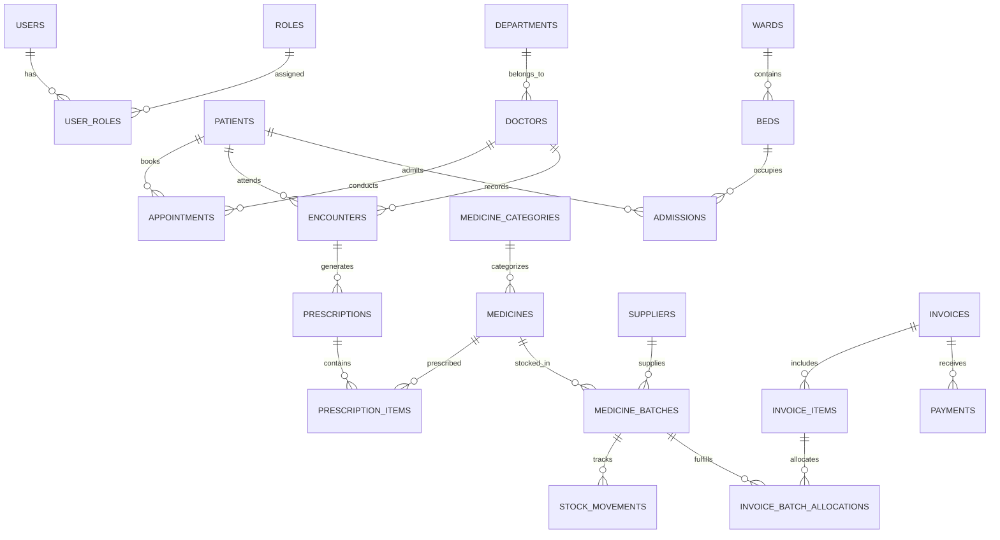

# MediCore HMS — Smart Hospital Management and Pharmacy Billing System

> **Major Project Submission — 3rd-Year B.Tech Information Technology**  
> GitHub Repository Target: [https://github.com/dj0707/Hospital_Managment_System_Full_Mern_Stack](https://github.com/dj0707/Hospital_Managment_System_Full_Mern_Stack)

---

## 1. Project Abstract & Objectives

**MediCore HMS** is a healthcare administration platform engineered using a **Java Full Stack architecture (Spring Boot 3 + React + TypeScript + MySQL)** complemented by modern MERN/JavaScript ecosystem tooling. The system delivers end-to-end hospital administration, clinical documentation (EHR), outpatient appointment scheduling, inpatient bed admissions, and a **high-precision Pharmacy Point-of-Sale (POS) counter with First-Expiry-First-Out (FEFO) batch inventory management**.

### Core Objectives
1. **Clean Database Architecture**: Relational schema with Flyway migrations compatible with **Aiven Cloud MySQL 8+**.
2. **Deterministic Financial Math**: 100% server-authoritative financial and discount calculations using Java `BigDecimal` (preventing floating-point rounding errors).
3. **Advanced Pharmacy POS & FEFO Dispensing**: Automated batch selection ensuring nearest-expiry batches are dispensed first, preventing expired medicine delivery.
4. **Role-Based Security**: Spring Security 6 with stateless JWT authentication and granular role authorization (`ADMIN`, `DOCTOR`, `RECEPTIONIST`, `PHARMACIST`, `ACCOUNTANT`, `PATIENT`).
5. **AI Operations Assistant**: Optional backend-integrated AI assistant for administrative questions, inventory advisory, and workflow guidance.

---

## 2. Architecture & Technology Justification

```
+-------------------------------------------------------------------------+
|                         React 18 + TypeScript                           |
|      (Tailwind CSS, Lucide Icons, React Router, Vite, Recharts)         |
+------------------------------------+------------------------------------+
                                     | REST (JSON / JWT)
                                     v
+------------------------------------+------------------------------------+
|                      Spring Boot 3.3.4 (Java 21)                        |
|  - Security & JWT Auth Filter     - Transactional Services (ACID)      |
|  - Bean Validation & Exceptions   - Concurrency Locking & Auditing     |
+------------------------------------+------------------------------------+
                                     | JPA / Hibernate / Flyway
                                     v
+------------------------------------+------------------------------------+
|                  Aiven Cloud MySQL 8.0 Relational DB                    |
|  - 23 Normalized Tables           - FEFO Expiry & Stock Tracking        |
+-------------------------------------------------------------------------+
```

### Why Java Spring Boot for Backend & React/TypeScript for Frontend?
- **Enterprise Robustness & Financial Integrity**: Java's strict typing, JPA transaction boundaries (`@Transactional`), and `BigDecimal` provide bulletproof accuracy for pharmaceutical billing and concurrency protection during simultaneous pharmacy checkouts.
- **Fast Interactive POS UI**: React with TypeScript and Tailwind CSS delivers sub-100ms debounced medicine catalog searches and instant live previews for busy hospital pharmacy counters.

---

## 3. Database ER & Key Entities (Mermaid Diagram)



---

## 4. Pharmacy FEFO Quantity Model

| Concept | Explanation |
| :--- | :--- |
| **Catalog Configuration** | Stored with `unitsPerStrip` (e.g., 10 tablets/strip). |
| **Inventory Stock Ledger** | All physical stock is recorded and deducted at the **base unit level** (e.g., individual tablets/capsules). |
| **POS Billing Screen** | Cashier enters quantity in **strips** (e.g., 3 strips). The backend computes: `3 * 10 = 30 base units`. |
| **FEFO Allocation** | Batches are queried using `ORDER BY expiryDate ASC` with pessimistic row locking. The system deducts 30 units across the earliest valid batches. |
| **Expired Stock Guard** | Batches where `expiryDate <= today` are automatically excluded from dispensing. |

---

## 5. Getting Started & Setup Guide

### Prerequisites
- **Java 21 LTS** & **Maven 3.8+**
- **Node.js 18+** & **npm**
- **MySQL 8.0+** (Local or Aiven Cloud MySQL)

### Step 1: Configure Environment Variables
Copy `.env.example` to `.env` or set environment variables:
```bash
# Database credentials
DB_HOST=localhost
DB_PORT=3306
DB_NAME=medicore_db
DB_USERNAME=root
DB_PASSWORD=root
DB_USE_SSL=false

# First Administrator Bootstrap
ADMIN_BOOTSTRAP_ENABLED=true
ADMIN_USERNAME=admin
ADMIN_PASSWORD=Admin@Medicore2026!
```

### Step 2: Start Spring Boot Backend
```bash
cd backend
mvn clean spring-boot:run
```
- Backend starts at: `http://localhost:8080`
- Swagger API Docs: `http://localhost:8080/swagger-ui.html`
- Automatic Flyway migrations run on startup, creating the schema and bootstrapping the administrator account.

### Step 3: Start React Frontend
```bash
cd frontend
npm install
npm run dev
```
- Frontend application starts at: `http://localhost:5173`

---

## 6. Docker Deployment

To launch the complete system (Backend + Frontend + MySQL) using Docker:
```bash
docker-compose up --build -d
```
- Frontend: `http://localhost:3000`
- Backend API: `http://localhost:8080`

---

## 7. Viva & Major Project Defense Q&A

1. **How is concurrency handled during simultaneous pharmacy checkouts?**  
   *Answer*: The backend queries available batches using `@Lock(LockModeType.PESSIMISTIC_WRITE)` within a `@Transactional` boundary, preventing race conditions or negative inventory stock.

2. **Why use Flyway instead of Hibernate's `ddl-auto: update`?**  
   *Answer*: Flyway provides version-controlled, reproducible SQL migration scripts (`V1__Initial_Schema.sql`), ensuring strict schema governance and preventing accidental column alterations in cloud databases.

3. **How does the AI module handle patient privacy?**  
   *Answer*: The AI assistant operates strictly on non-identifiable administrative concepts and aggregate operational metrics. No private patient demographic or clinical records are sent to external LLMs.
